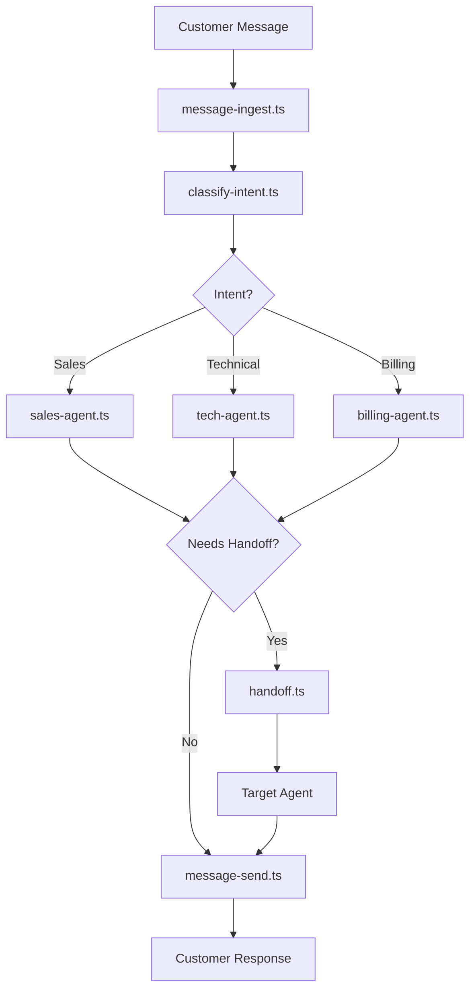

# AI-Powered Multi-Agent Customer Support System

A real-time customer support system built on the Motia framework featuring three specialized AI agents that collaborate to handle customer inquiries with intelligent routing and seamless handoffs.

## 🌟 Features

- **Multi-Agent Architecture**: Sales, Technical Support, and Billing agents with specialized knowledge
- **Intelligent Intent Classification**: OpenAI-powered routing to the right agent
- **Seamless Agent Handoffs**: Context-preserving transfers between specialists
- **Event-Driven Design**: Built on Motia's event system for scalability
- **Real-time Processing**: Fast response times using GPT-4o-mini
- **Comprehensive Knowledge Base**: JSON-based knowledge management
- **Conversation State Management**: Full context preservation across handoffs

## 🚀 Quick Start

### Prerequisites

- Node.js 18+
- Bun (recommended) or npm
- OpenAI API key

### Installation

1. **Clone and setup**:
   ```bash
   git clone <repository-url>
   cd ai-customer-support-motia
   bun install
   ```

2. **Configure environment**:
   ```bash
   cp .env.example .env
   # Edit .env and add your OPENAI_API_KEY
   ```

3. **Start development server**:
   ```bash
   bun run dev
   ```

4. **Open Motia Workbench**:
   Navigate to `http://localhost:3000/workbench` to monitor agent interactions

### Testing the System

Send a POST request to test the message flow:

```bash
curl -X POST http://localhost:3000/api/messages \
  -H "Content-Type: application/json" \
  -d '{
    "customerId": "customer123",
    "message": "I want to upgrade my plan"
  }'
```

## 🏗️ Architecture

### Motia Steps Overview

```
steps/
├── api/
│   ├── message-ingest.ts      # Customer message API endpoint
│   └── message-send.ts        # Response delivery handler
├── router/
│   └── classify-intent.ts     # OpenAI-powered intent classification
├── agents/
│   ├── sales-agent.ts         # Sales inquiries and upgrades
│   ├── tech-agent.ts          # Technical support and troubleshooting
│   └── billing-agent.ts       # Billing and payment assistance
└── coordinator/
    └── handoff.ts             # Inter-agent handoff management
```

### Event Flow



### Agent Specializations

| Agent | Handles | Handoff Triggers |
|-------|---------|------------------|
| **Sales** | Product inquiries, pricing, demos, upgrades | Technical issues → Tech, Payment questions → Billing |
| **Technical** | Troubleshooting, setup, bugs, integrations | Product questions → Sales, Billing issues → Billing |
| **Billing** | Payments, invoices, refunds, subscriptions | Feature questions → Sales, Tech issues → Technical |

## 📊 Demo Scenarios

### 1. Sales → Tech Handoff
```bash
# Customer asks about upgrade
curl -X POST http://localhost:3000/api/messages -H "Content-Type: application/json" -d '{"customerId": "demo1", "message": "I want to upgrade my plan"}'

# Then asks technical question
curl -X POST http://localhost:3000/api/messages -H "Content-Type: application/json" -d '{"customerId": "demo1", "message": "Will my data migrate automatically?", "sessionId": "conv_demo1_[timestamp]"}'
```

### 2. Billing → Sales Loop
```bash
# Customer asks about invoice
curl -X POST http://localhost:3000/api/messages -H "Content-Type: application/json" -d '{"customerId": "demo2", "message": "I have a question about my invoice"}'

# Then wants to upgrade
curl -X POST http://localhost:3000/api/messages -H "Content-Type: application/json" -d '{"customerId": "demo2", "message": "Actually, I want to upgrade to get more features", "sessionId": "conv_demo2_[timestamp]"}'
```

### 3. Complex Multi-Agent
```bash
# Billing issue
curl -X POST http://localhost:3000/api/messages -H "Content-Type: application/json" -d '{"customerId": "demo3", "message": "I was charged twice this month"}'

# Technical problem
curl -X POST http://localhost:3000/api/messages -H "Content-Type: application/json" -d '{"customerId": "demo3", "message": "Also, the billing dashboard is not loading", "sessionId": "conv_demo3_[timestamp]"}'

# Wants to upgrade
curl -X POST http://localhost:3000/api/messages -H "Content-Type: application/json" -d '{"customerId": "demo3", "message": "After this is fixed, I want to upgrade my plan", "sessionId": "conv_demo3_[timestamp]"}'
```

## 📁 Knowledge Base Structure

```
knowledge/
├── sales/
│   ├── products.json          # Product features, pricing, plans
│   └── scripts.json           # Sales scripts, objection handling
├── technical/
│   ├── documentation.json     # User guides, API docs
│   └── troubleshooting.json   # Common issues, solutions
└── billing/
    ├── policies.json          # Billing policies, refund rules
    └── plans.json             # Subscription details, pricing
```

## 🔧 Configuration

### Environment Variables

| Variable | Description | Default |
|----------|-------------|---------|
| `OPENAI_API_KEY` | OpenAI API key for agent responses | Required |
| `MOTIA_PORT` | Server port | 3000 |
| `NODE_ENV` | Environment setting | development |
| `LOG_LEVEL` | Logging verbosity | debug |

### Agent Configuration

Each agent can be customized by editing their respective files:
- Response tone and personality
- Knowledge base integration
- Handoff trigger rules
- OpenAI model parameters

## 📈 Monitoring

### Motia Workbench

Access `http://localhost:3000/workbench` to:
- Monitor real-time conversation flows
- Debug agent handoffs and decisions
- View conversation traces and state changes
- Analyze system performance metrics

### Key Metrics

- **Response Time**: Target < 5 seconds
- **Intent Classification Accuracy**: Target > 80%
- **Handoff Success Rate**: Target > 90%
- **Concurrent Conversations**: Supports 10+ simultaneously

## 🔄 Development Commands

```bash
# Development
bun run dev                    # Start with hot reload

# Production
bun run build                  # Build the project
bun run start                  # Start production server

# Utilities
bun run emit                   # Emit test events
```

## 🎯 Success Criteria

✅ **Multi-agent collaboration** in single Motia runtime
✅ **Intelligent routing** using OpenAI classification
✅ **Context preservation** across agent handoffs
✅ **Event-driven architecture** with clean separation
✅ **Real-time processing** with <5s response times
✅ **Comprehensive knowledge base** integration
✅ **Full observability** through Motia Workbench

## 🚧 Extending the System

### Adding New Agents

1. Create agent file in `steps/agents/`
2. Implement knowledge base in `knowledge/`
3. Update intent classification in `classify-intent.ts`
4. Add handoff triggers in existing agents

### Integrating External Systems

- **CRM Integration**: Add customer lookup in message-ingest.ts
- **Payment Processing**: Enhance billing-agent.ts with Stripe
- **Ticket System**: Connect to external support platforms
- **Analytics**: Add event tracking for business insights

## 📄 License

MIT License - see LICENSE file for details.

---

*This system demonstrates Motia's power to unify multi-agent AI workflows in a single, event-driven runtime.*